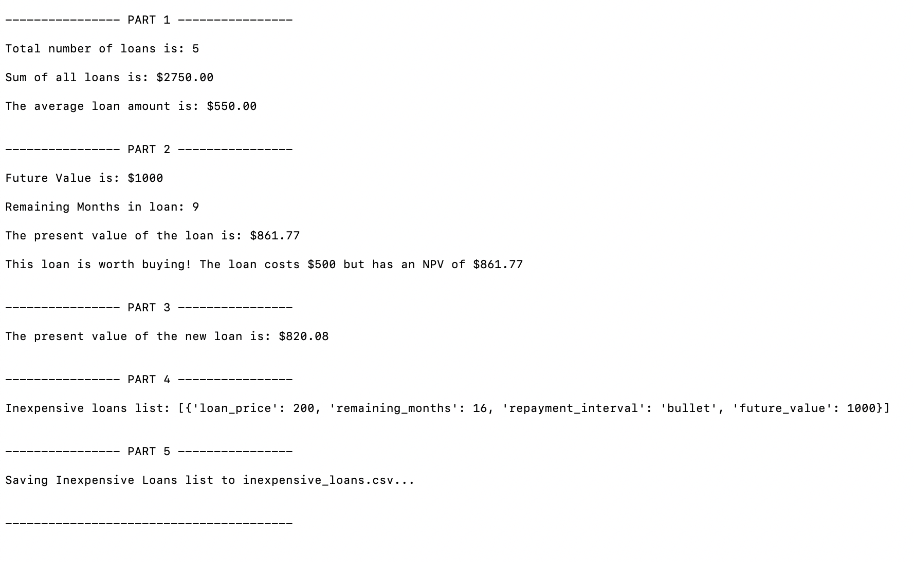

# **Module_1_Challenge**

This is a five-part python program to evaluate microcredit loans. It automates the collection of data, analyzes data, performs financial calculations, filters a list of loans, and writes qualified loans to a file.

---

## **Technologies**

This project uses python 3.7 and csv.py writer

---

## *Installation Guide*

No additional software packages required.

---

## *Usage*
To use this program, clone the repository and run **loan_analyzer.py** with:

```python
python loan_analyzer.py
```
After launching the app, you will get output that looks like this: 



---

## *Contributors*

Antonia Hurst

---

## *License*

MIT