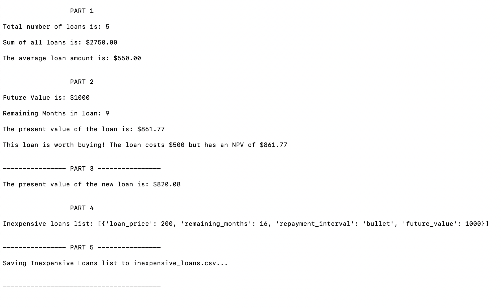
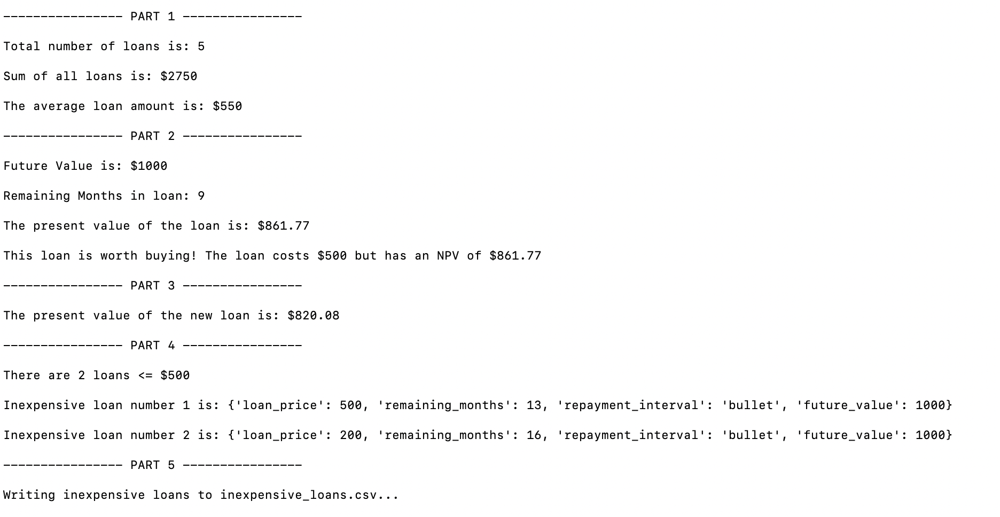

# Module_1_Challenge

This is a five-part python program to evaluate microcredit loans. It automates the collection of data, analyzes data, performs financial calculations, filters a list of loans, and writes qualified loans to a file.

Note: Is there is a conflict in the directions? For Part 4: Conditionally Filter Lists of Loans, #2 says "...determine whether loan_price is < 500" and #3 says "...500 or less" and later, under Filter Lists of Loans (10 points) saying "append the inexpensive_loans list with loan_price that are less than 500". 

Both versions are presented here: 
loan_analyzer_less_than_500.py writes to inexpensive_loans.csv
loan_analyzer_less_than_or_equal_to_500 writes to inexpensive_loans_less_than_or_equal to_500.csv

---

## Technologies

This project uses python 3.7 and csv.py writer

---

## Installation Guide

No additional software packages required.

---

## **Usage**
To use this program, clone the repository and run **python loan_analyzer_less_than_500.py** OR python loan_analyzer_less_than__or_equal_to_500.py with:

```python
python loan_analyzer_less_than_500.py
```

or 

```python
python loan_analyzer_less_than_or_equal_to_500.py
```

Depending on which app you run, you will get output that looks one of this screens: 



---



---

## Contributors

Antonia Hurst

---

## License

MIT